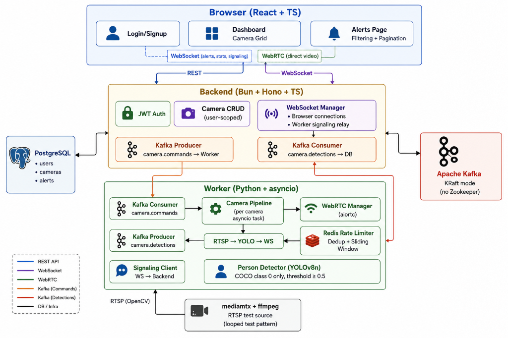

# Skylark VMS — Real-Time Camera Surveillance Dashboard

A full-stack Video Management System with real-time person detection, WebRTC streaming, and a premium dark-mode surveillance dashboard UI.

**Author**: Ujjwal Mishra (<ujjwalmishra714@gmail.com>)

## Architecture



## Key Design Decisions

### Why Python for the Worker?
The PDF allows any language (Go preferred). We chose **Python** because:
- **Ultralytics YOLOv8** has first-class Python support with a one-line API
- **aiortc** provides server-side WebRTC in pure Python
- **aiokafka** is async-native and fits the asyncio model perfectly
- **OpenCV** Python bindings are the industry standard for RTSP ingestion
- The asyncio event loop with `to_thread` for CPU-bound YOLO inference gives us concurrent camera processing without the complexity of goroutines

### Why YOLOv8n?
- **YOLOv8n** ("nano") is the smallest and fastest model in the YOLOv8 family
- ~3.2M parameters — runs efficiently on CPU without GPU requirements
- Still achieves ~37.3 mAP on COCO, which is more than sufficient for person detection
- Filtered to `classes=[0]` (COCO person class) for focused detection
- Confidence threshold of **0.5** balances sensitivity with false-positive reduction
- Inference runs via `asyncio.to_thread` to avoid blocking the event loop

### Why Kafka (not direct HTTP)?
- Decouples the backend from the worker — either can restart independently
- Per-camera message ordering via partition keys ensures detection events arrive in order
- Supports future scaling to multiple worker instances
- The bonus requirement in the PDF specifically mentions message queues

### Why a Separate Signaling WebSocket?
WebRTC SDP offer/answer exchange needs sub-second latency. Kafka's eventually-consistent delivery model (batching, consumer lag) would make WebRTC negotiation unreliable. A dedicated WebSocket between Backend↔Worker ensures signaling feels instant.

## Event Format

This shape is identical across Worker → Kafka → Backend → DB → WebSocket → Frontend:

```json
{
  "id": "a1b2c3d4-...",
  "cameraId": "f9e8d7c6-...",
  "type": "person_detected",
  "confidence": 0.91,
  "boundingBox": { "x": 120, "y": 45, "width": 80, "height": 200 },
  "detectedAt": "2026-06-23T10:15:30.123Z"
}
```

## Alert Deduplication & Rate Limiting

Using Redis sorted sets, per camera:
- **Dedup**: Suppresses new alerts if the last one fired < 5 seconds ago (configurable via `ALERT_DEDUP_WINDOW_SECONDS`)
- **Rate limit**: Hard cap of 30 alerts/camera/minute via sliding-window sorted set (configurable via `ALERT_RATE_LIMIT_PER_MINUTE`)
- **Fail-open**: If Redis is unavailable, all alerts pass through (no silent drops)

## How to Run

### Prerequisites
- Docker and Docker Compose installed

### Quick Start

```bash
# Clone the repo
git clone <repo-url>
cd skylark-vms

# Copy environment config
cp .env.example .env

# Start everything
docker compose up --build
```

### Access

| Service | URL |
|---------|-----|
| Frontend | http://localhost |
| Backend API | http://localhost:3000 |
| Backend Health | http://localhost:3000/health |
| RTSP Test Stream | rtsp://localhost:8554/live/test1 |

### First Steps
1. Open http://localhost in your browser
2. Create an account (Sign Up)
3. Add a camera with RTSP URL: `rtsp://mediamtx:8554/live/test1`
4. Click "Start" to begin streaming and detection

## API Reference

### Auth
| Method | Path | Body | Description |
|--------|------|------|-------------|
| POST | `/auth/signup` | `{ username, password }` | Create account, returns JWT |
| POST | `/auth/login` | `{ username, password }` | Login, returns JWT |

### Cameras (JWT required)
| Method | Path | Body | Description |
|--------|------|------|-------------|
| GET | `/cameras` | — | List user's cameras |
| POST | `/cameras` | `{ name, rtspUrl, location? }` | Create camera |
| GET | `/cameras/:id` | — | Get camera |
| PUT | `/cameras/:id` | `{ name?, rtspUrl?, location?, enabled? }` | Update camera |
| DELETE | `/cameras/:id` | — | Delete camera |
| POST | `/cameras/:id/start` | — | Start camera processing |
| POST | `/cameras/:id/stop` | — | Stop camera processing |

### Alerts (JWT required)
| Method | Path | Query Params | Description |
|--------|------|-------------|-------------|
| GET | `/alerts` | `cameraId`, `from`, `to`, `page`, `limit` | List alerts with filtering |

### WebSocket
Connect to `ws://localhost:3000/ws?token=<JWT>` for real-time updates.

## Testing

### Backend Tests (Bun test runner)
```bash
cd backend && bun test
```

Tests cover:
- Signup rejects duplicate username
- Login rejects wrong password
- Camera creation rejects missing RTSP URL
- Integration: signup → login → create camera → fetch alerts (empty)

### Worker Tests (Python unittest)
```bash
cd worker && python -m pytest tests/
```

Tests cover:
- Only detections above confidence threshold produce events
- Detections below threshold are filtered out
- Bounding box format (x, y, width, height)
- Event has all required fields
- Camera ID tagging on async detect

## Project Structure

```
skylark-vms/
├── frontend/          React + TS + Vite
│   ├── src/
│   │   ├── api/       API client
│   │   ├── components/ CameraCard, CameraForm, AlertList, Layout, etc.
│   │   ├── contexts/  AuthContext
│   │   ├── hooks/     useAuth
│   │   ├── pages/     LoginPage, DashboardPage, AlertsPage
│   │   └── types/     Shared TypeScript types
│   ├── Dockerfile
│   └── nginx.conf
├── backend/           Bun + Hono + TS
│   ├── src/
│   │   ├── db/        Drizzle schema, connection, migrations
│   │   ├── lib/       Logger, Kafka client, WebSocket manager
│   │   ├── middleware/ JWT auth
│   │   ├── routes/    Auth, Cameras, Alerts
│   │   └── __tests__/ API tests
│   └── Dockerfile
├── worker/            Python + asyncio
│   ├── src/
│   │   ├── main.py          Entry point / orchestrator
│   │   ├── config.py        Environment config
│   │   ├── detector.py      YOLOv8n person detection
│   │   ├── rtsp_ingester.py OpenCV RTSP frame reader
│   │   ├── camera_pipeline.py  Per-camera asyncio task
│   │   ├── webrtc_manager.py   aiortc WebRTC handling
│   │   ├── kafka_client.py     aiokafka consumer/producer
│   │   ├── signaling_client.py WebSocket to backend
│   │   └── rate_limiter.py     Redis dedup + rate limiting
│   ├── tests/
│   └── Dockerfile
├── docker-compose.yml
├── mediamtx.yml
├── .env.example
├── PROGRESS.md
└── README.md
```

## Future Improvements

- **Kubernetes deployment**: Helm charts for each service, horizontal pod autoscaling for workers
- **SFU for multi-viewer**: Replace direct WebRTC with an SFU (e.g., Janus, mediasoup) so multiple viewers don't each need their own peer connection from the worker
- **Multi-broker Kafka cluster**: For higher camera counts, scale to 3+ brokers with proper replication
- **GPU acceleration**: Move YOLO inference to GPU with CUDA/TensorRT for 10x throughput
- **Alert snapshots**: Store detection frame thumbnails in object storage (S3/MinIO)
- **RBAC**: Role-based access control (admin, operator, viewer)
- **Recording**: Save video clips around detection events for forensic review
- **Prometheus + Grafana**: Metrics export for camera FPS, detection latency, Kafka lag
